<p align="center">
  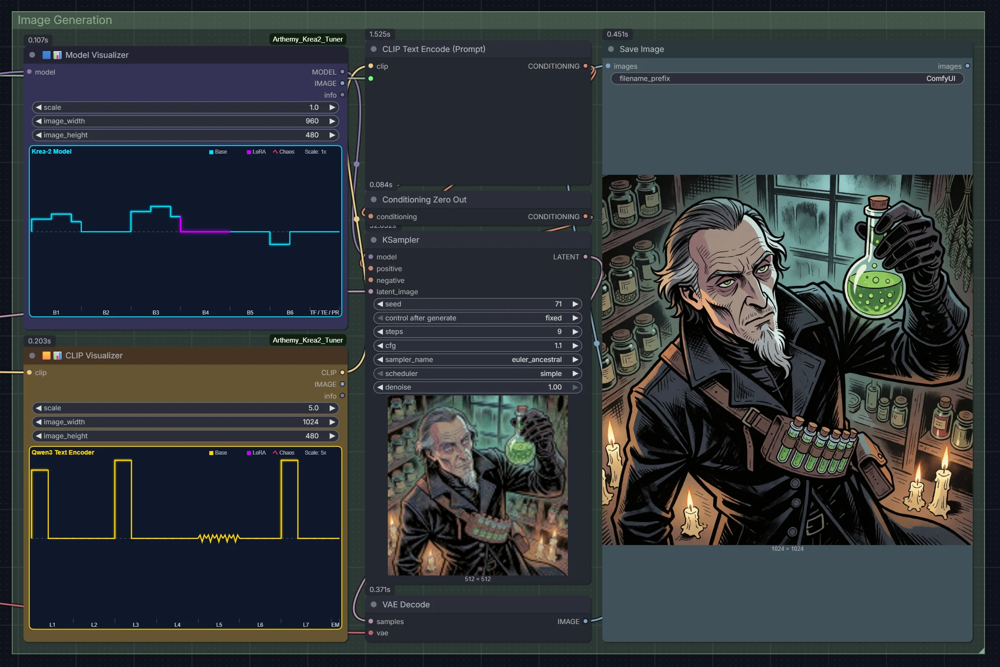
</p>

<h1 align="center">Arthemy Krea-2 Tuner</h1>

<p align="center">
  Live weight tuning for <b>Krea-2</b> diffusion models and their <b>Qwen3</b> text encoder, directly inside ComfyUI.
</p>

<p align="center">
  
  
  <a href="#license"></a>
  
</p>

---

Edit a **Krea-2** model and its **CLIP** text encoder by multiplying specific internal weights up or down, live, **no dataset and no training required**. Move a slider, generate, and compare against the untouched model. When you land on a result you like, save it as a lightweight preset or bake it into a full `.safetensors` checkpoint.

Built for anyone who wants to push a model toward a specific look or behavior — a color palette, a rendering style, a recurring motif — by editing what's already inside it, instead of fine-tuning from scratch.

> [!NOTE]
> **Requires:** Krea-2 diffusion checkpoints + a Qwen3 text encoder (including Qwen3-VL 4B/8B/32B). Block counts and tensor names are matched to this architecture; these nodes won't affect other model families as-is.

<p align="center">
  <a href="assets/examples/XYBenchmark.webp">
    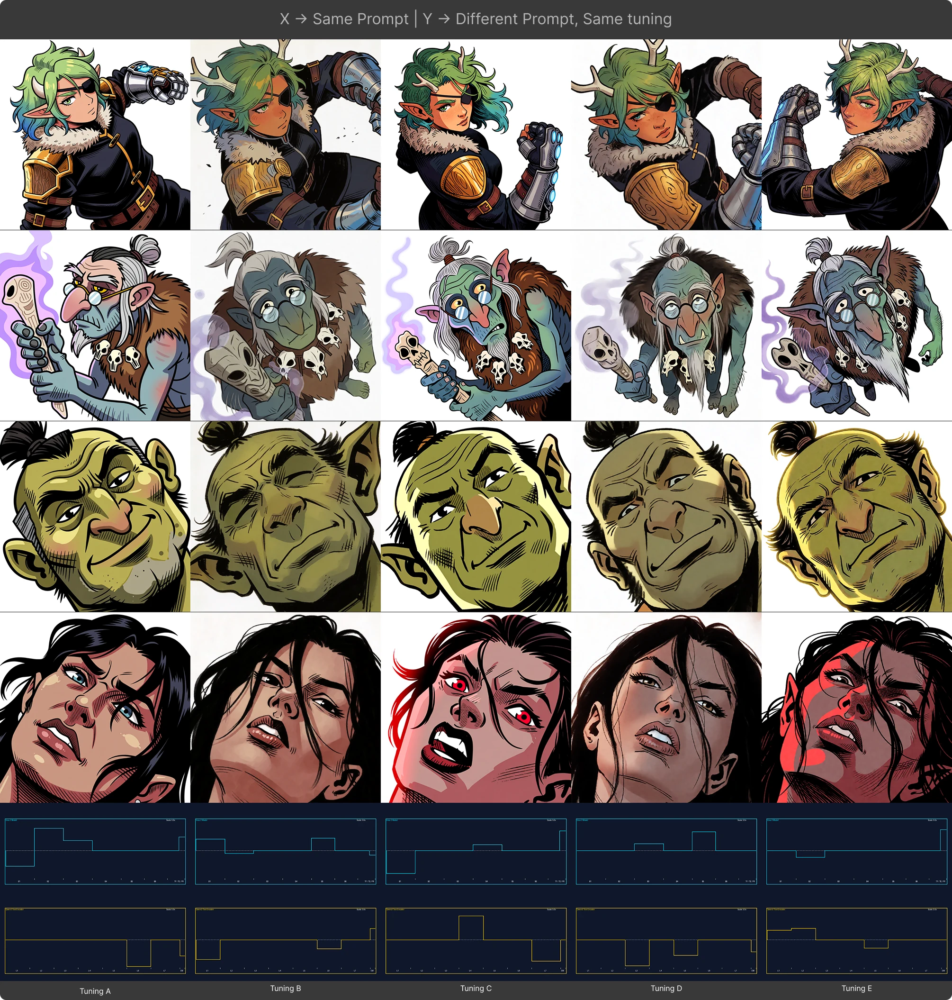
  </a>
  <br>
  <sub><i>How different promtps behave to different tuning.</i></sub>
</p>

---

## Contents

- [Installation](#installation)
- [Quick Start](#quick-start)
- [Included Template Workflow](#included-template-workflow)
- [Picking the Right Node](#picking-the-right-node)
  - [Model Tuning](#tier-1--tuner-whole-groups)
  - [CLIP Tuning](#clip-tuning-qwen3)
  - [LoRA Tuning](#lora-tuning)
  - [Summary Table](#summary-table)
- [Reading the Sliders](#reading-the-sliders)
- [Saving and Loading Calibrations](#saving-and-loading-calibrations)
- [Visualizing Active Patches](#visualizing-active-patches)
- [Troubleshooting](#troubleshooting)
- [Visual Tuning Showcase & Effects](#visual-tuning-showcase--effects)
- [Author](#author)
- [License](#license)

---

## Installation

### Option 1: Via ComfyUI Manager (Install via Git URL)
In **ComfyUI Manager**, click **Install via Git URL**, paste the repository URL:
```text
https://github.com/aledelpho/comfyui-arthemy-krea2-tuner.git
```
and click **Install**.

### Option 2: Manual Installation (Git Clone)
Clone this repository directly into your ComfyUI `custom_nodes` folder:

```bash
cd ComfyUI/custom_nodes
git clone https://github.com/aledelpho/comfyui-arthemy-krea2-tuner.git
```

*Restart ComfyUI completely afterward.*

---

## Quick Start

1. **Load** your `MODEL` and `CLIP` normally in your workflow.
2. Add a **`🟦 Model Tuner`** node and route `MODEL` through it.
3. Move one of the block sliders (`Block_1` … `Block_6`) away from `0.00` (`0.00` = no change; positive values strengthen that group, negative values weaken it).
4. Connect the Tuner's `MODEL` output to your sampler and generate. Compare against the untouched model — with a slider away from `0.00`, you should see an immediate visual shift. If the outputs look identical, verify your checkpoint is Krea-2/Qwen3 (see [Troubleshooting](#troubleshooting)).
5. *(Optional)* Chain a **`🟨 CLIP Tuner`** on the `CLIP` wire to adjust text encoder layers simultaneously.

---

## Included Template Workflow

The suite comes with a pre-configured, modular sandbox workflow located in [`workflows/TestKrea2TunerWorkflow.json`](workflows/TestKrea2TunerWorkflow.json):

<p align="center">
  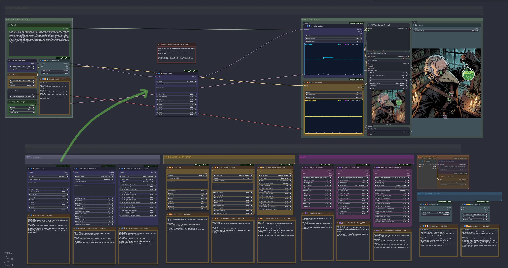
</p>

### How to use the sandbox:
1. **Load the template:** Drag and drop `workflows/TestKrea2TunerWorkflow.json` into ComfyUI.
2. **Pick any tool:** Choose any tuning node or LoRA loader from the organized library at the bottom.
3. **Plug into the staging slot:** Attach your chosen tool in the open space between the **Loaders / Reset Patcher** and the **Visualizers & Generation** zone.
4. **Tune & Cook:** Adjust your sliders, verify the live patch waveform in the visualizers, and generate!

---

## Picking the Right Node

Every domain — **Model**, **CLIP**, and **LoRA** — is tuned through three tiers of precision.

<p align="center">
  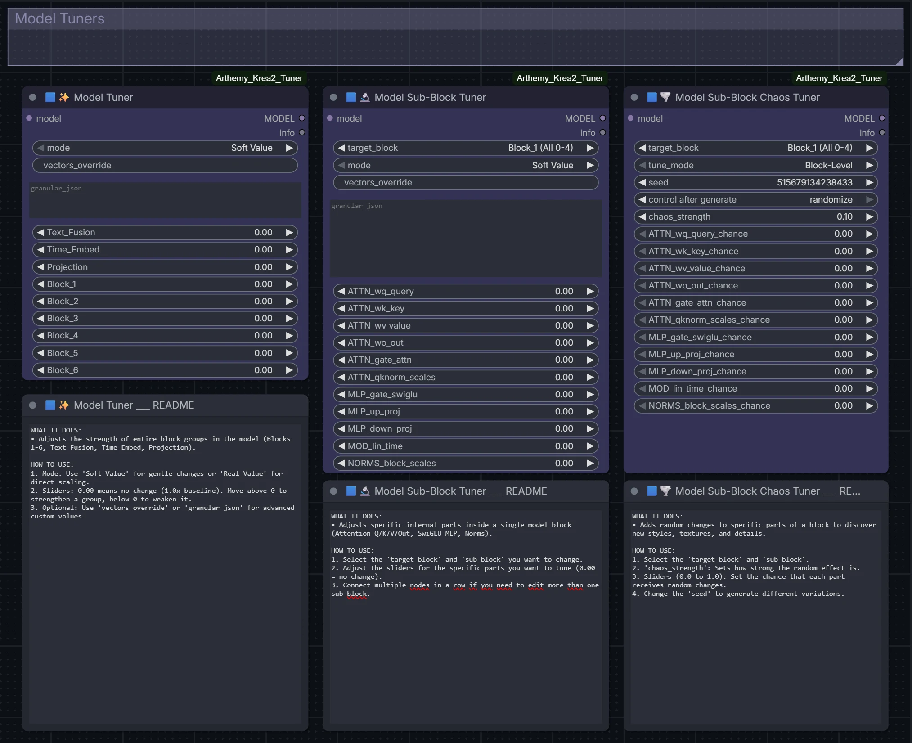
</p>

### Tier 1 — Tuner (Whole Groups)
**`🟦 Model Tuner`** provides one slider per group of blocks: `Text_Fusion`, `Time_Embed`, `Projection`, and `Block_1` through `Block_6`. Moving a slider scales every tensor inside that group by the same offset.
* **Use case:** Broad exploration — *"Let's see which general region influences my output."*
* **Workflow:** `MODEL` → `🟦 Model Tuner` → `Sampler`. Nudge one slider at a time, generate, and compare.

<p align="center">
  <a href="assets/examples/Block_3.webp">
    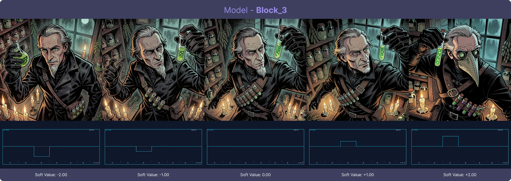
  </a>
  <br>
  <sub><i>Block Tuning — Modulating an entire block (Block_3) across different values (-2.0 to +2.0) demonstrates how group-level tuning shapes visual structures and features.</i></sub>
</p>

### Tier 2 — Sub-Block Tuner (Block + Tensor Type)
**`🟦 Model Sub-Block Tuner`** narrows the target: select one block from the `target_block` dropdown, then adjust individual sliders for specific internal tensor types (`ATTN_wq_query`, `ATTN_wk_key`, `ATTN_wv_value`, `ATTN_wo_out`, `MLP_gate_swiglu`, `MLP_up_proj`, `MLP_down_proj`, `NORMS_block_scales`, etc.).
* **Use case:** When a Block is both improving and ruining your ouputs, you can use this tool to identify what parts of that specific block you want to boost — *"Block 3 is promising, let's give it a closer look."*
* **Workflow:** Follows a Tier 1 pass. Set `target_block` to the region identified in Tier 1 and sweep tensor-type sliders individually.

<p align="center">
  <a href="assets/examples/sub-block-Tuning.webp">
    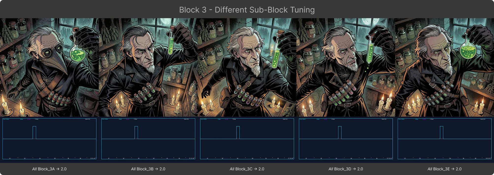
  </a>
  <br>
  <sub><i>Sub-Block Tuning — Modulating specific sub-blocks within Block 3 influences fine details and layer-level characteristics.</i></sub>
</p>

### Tier 3 — Chaos Tuner (Seeded Randomness)
**`🟦 Model Sub-Block Chaos Tuner`** uses the same targeting as Tier 2, but applies a seeded perturbation: with probability `chance`, each matched tensor is perturbed by `chaos_strength`. Same seed = deterministic, reproducible noise every time.
* **Block-Level mode:** Perturbs an entire tensor at once.
* **Element-Level (Sub-atomic) mode:** Rolls per individual weight for finer granularity.
* **Use case:** Creative discovery — *"Randomly nudge one sub-slice and lock the seed once an interesting style emerges."*

<p align="center">
  <a href="assets/examples/chaos-block-Tuning.webp">
    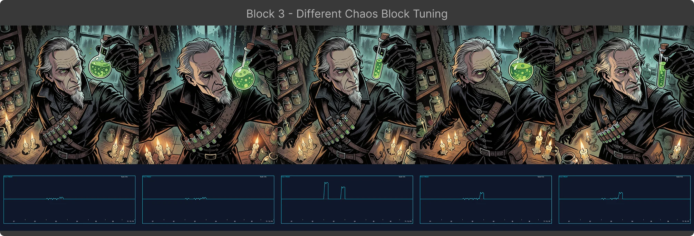
  </a>
  <br>
  <sub><i>Chaos Tuning — Seeded stochastic perturbations applied across sub-blocks introduce controlled stylistic variations and creative discovery.</i></sub>
</p>

---

### 🟨 CLIP Tuning (Qwen3)
<p align="center">
  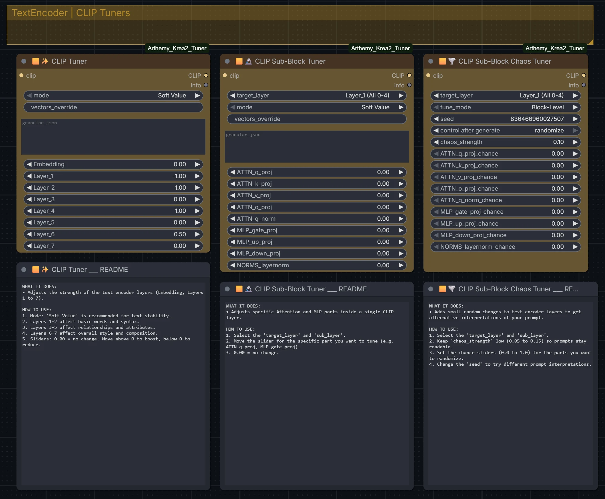
</p>

Tuning applied to the Qwen3 text encoder follows the identical 3-tier structure:
* **`🟨 CLIP Tuner` (Tier 1):** One slider per group (`Embedding`, `Layer_1` through `Layer_7`).
* **`🟨 CLIP Sub-Block Tuner` (Tier 2):** Select a specific layer, then adjust Qwen3-equivalent internal tensor sliders.
* **`🟨 CLIP Sub-Block Chaos Tuner` (Tier 3):** Seeded perturbation scoped to CLIP layers.

---

### 🟪 LoRA Tuning
<p align="center">
  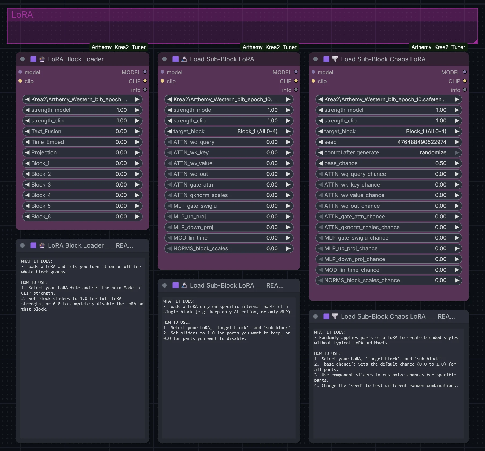
</p>

* **`🟪 LoRA Block Loader` (Tier 1):** Drop-in replacement for standard LoRA loaders with per-section strength multipliers.
* **`🟪 Load Sub-Block LoRA` (Tier 2):** Targets one block and tensor type (e.g., keep only attention layers of a LoRA and drop the rest).
* **`🟪 Load Sub-Block Chaos LoRA` (Tier 3):** Randomly retains or drops LoRA keys based on probability sliders and a seed.

---

### Summary Table

| Domain | Tier 1 — Group-level | Tier 2 — Block + Tensor Type | Tier 3 — Random / Seeded |
| :--- | :--- | :--- | :--- |
| **Model** | `🟦 Model Tuner` | `🟦 Model Sub-Block Tuner` | `🟦 Model Sub-Block Chaos Tuner` |
| **CLIP** | `🟨 CLIP Tuner` | `🟨 CLIP Sub-Block Tuner` | `🟨 CLIP Sub-Block Chaos Tuner` |
| **LoRA** | `🟪 LoRA Block Loader` | `🟪 Load Sub-Block LoRA` | `🟪 Load Sub-Block Chaos LoRA` |

---

## Reading the Sliders

Tier 1 and Tier 2 sliders represent offsets from baseline (`0.00` = no modification). Two calculation modes are available per node:

| Mode | Formula | Use For |
| :--- | :--- | :--- |
| **Soft Value** | `1.0 + (slider × 0.10)` | Gentle adjustments — a slider of `1.0` moves the weight by +10%. *(Recommended default)* |
| **Real Value** | `1.0 + slider` | Direct multiplier — a slider of `1.0` doubles the weight (+100%). For aggressive changes. |

* **Chaos Sliders:** `chance` (`0.0`–`1.0`) defines the probability a tensor is touched; `chaos_strength` controls the perturbation amplitude.

### Optional Scripting Overrides
* **`vectors_override`**: Comma-separated list of raw values setting every group slider at once (34 values for Model Tuner, 8 for CLIP Tuner). Leave empty to use UI sliders.
* **`granular_json`**: JSON map targeting specific tensor-key substrings with custom weights:
  ```json
  {"blocks.3.attn.wq": 0.4, "blocks.3.mlp.down": -0.2}
  ```

---

## Saving and Loading Calibrations

Tuning occurs live in memory and **does not modify original checkpoint files**.

### 1. Presets (Lightweight JSON)
<p align="center">
  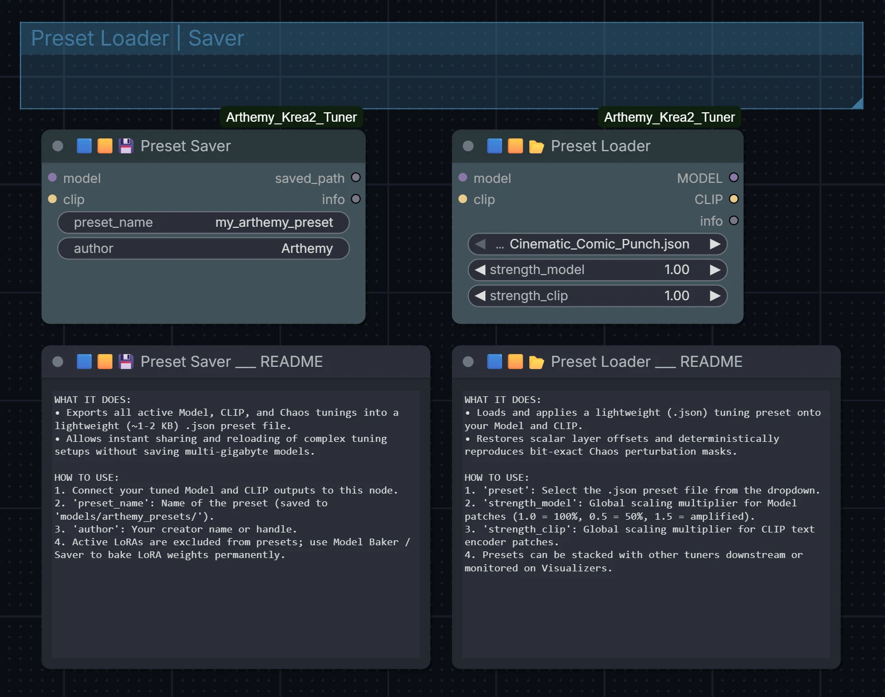
</p>

* **`🟦🟨 Preset Saver`**: Captures all active patches and Chaos seeds into a small JSON file for deterministic reproduction.
* **`🟦🟨 Preset Loader`**: Loads saved presets onto fresh `MODEL`/`CLIP` streams with global `strength_model` and `strength_clip` dials.

> [!WARNING]
> Presets capture Tuner and Chaos offsets only — not active LoRAs. Use the **Model Baker** first if you wish to bake LoRA weights permanently into the preset.

### 2. Permanent Export (Full Checkpoints)
<p align="center">
  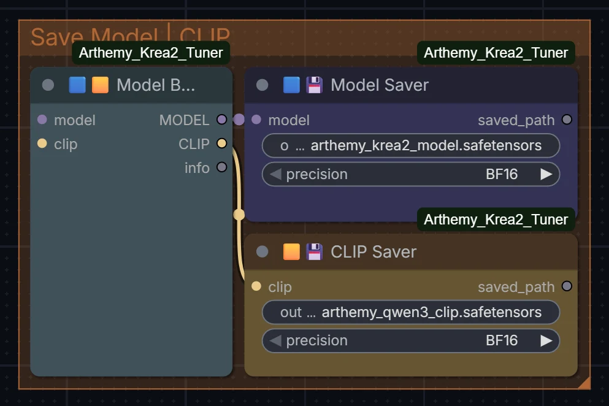
</p>

* **`🟦🟨 Model Baker`**: Folds all active memory patches permanently into the model weights and clears the runtime patch list.
* **`🟦 Model Saver` / `🟨 CLIP Saver`**: Exports tuned models to `.safetensors` (BF16 or FP8), streamed directly to disk to prevent OOM errors.
* **`🟦🟨 Reset Patcher`**: Clears all active patches and restores the model to clean baseline in memory.

---

## Visualizing Active Patches

* **`🟦 Model Visualizer` / `🟨 CLIP Visualizer`**: Real-time graph nodes that render a bar chart of active weight modifications across blocks before rendering.

---

## Troubleshooting

* **Nodes don't appear in ComfyUI:** Restart the ComfyUI server process completely (refreshing the browser tab is not sufficient).
* **Sliders produce no visible change:** Ensure the loaded model is a **Krea-2** checkpoint with a **Qwen3** text encoder. On unsupported models, tensor names do not match and patches apply to 0 tensors.
* **Out of Memory (OOM) during baking/saving:** Model Baker and Savers use chunked streaming, but large checkpoints still require memory overhead. Close background GPU tasks before exporting.
* **Saved preset doesn't include my LoRA:** Presets only store offset multipliers. Use **`🟦🟨 Model Baker`** to fuse the LoRA into the model before saving.

---

## Visual Tuning Showcase & Effects

A visual reference gallery showing how modulating each Model block and CLIP layer influences output in isolation.

### Benchmark Baseline Prompt (Used across all examples)

```text
Western comics style, bold ink outlines, hatched shadows, eerie detached calm, seen from a dutch high angle close-up, upper body portrait, dynamic pose, dramatic angle, strong perspective. male human plague doctor, thinning gray hair slicked back, thin sparse eyebrows, pale sickly skin gradient, gaunt older adult, long thin gloved fingers, a wispy gray goatee, deep tired wrinkles, dull green eyes. narrow jaw, tall lanky frame, eerie detached calm stare. a long black waxed-leather coat with a high collar, a satchel of glass vials strapped across his chest. holding a bubbling green potion vial up to the light. Background: a dim candle-lit apothecary shop cluttered with shelves of jars and dried herbs. Lighting: flickering warm candlelight from below mixing with cool teal moonlight through a fogged window, creating dramatic contrast across his face.
```

### 🟦 Model Tuning Effects (Blocks 1–6, Text Fusion, Time Embed, Projection)

| | |
|---|---|
| **Block 1** <br> <a href="assets/examples/Block_1.webp">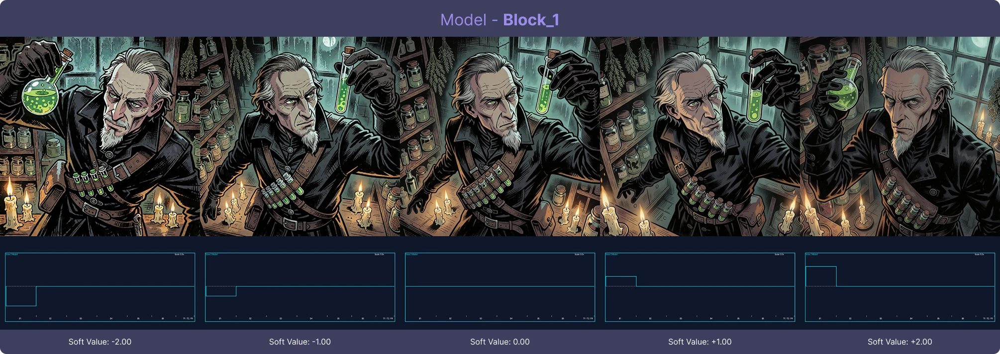</a> | **Block 2** <br> <a href="assets/examples/Block_2.webp">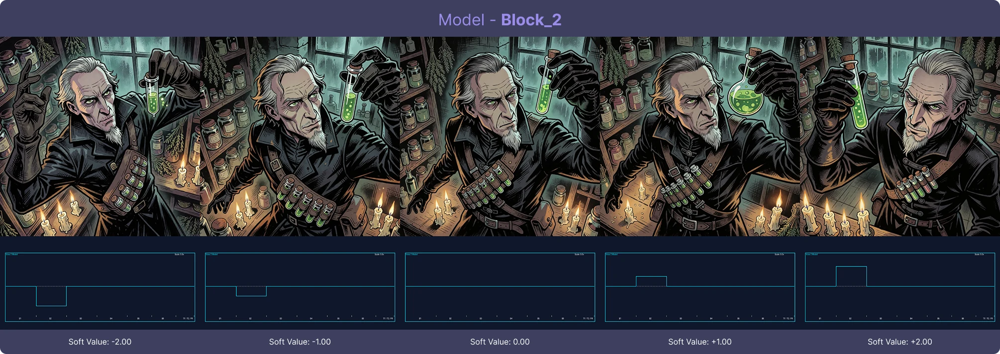</a> |
| **Block 3** <br> <a href="assets/examples/Block_3.webp"></a> | **Block 4** <br> <a href="assets/examples/Block_4.webp">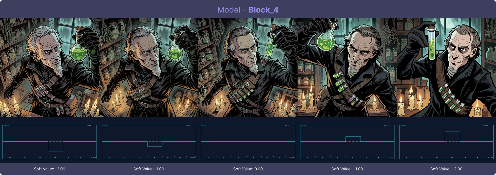</a> |
| **Block 5** <br> <a href="assets/examples/Block_5.webp">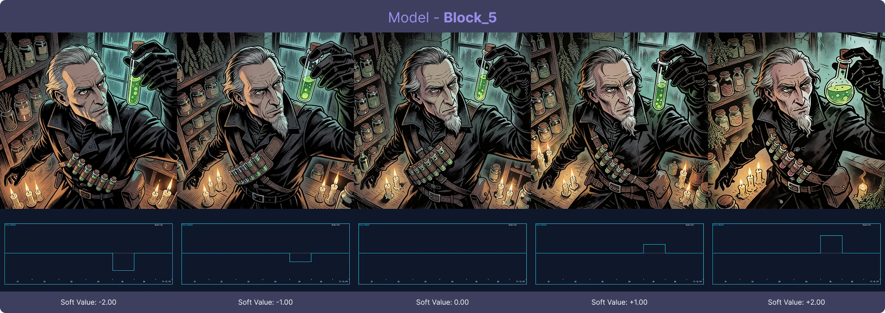</a> | **Block 6** <br> <a href="assets/examples/Block_6.webp">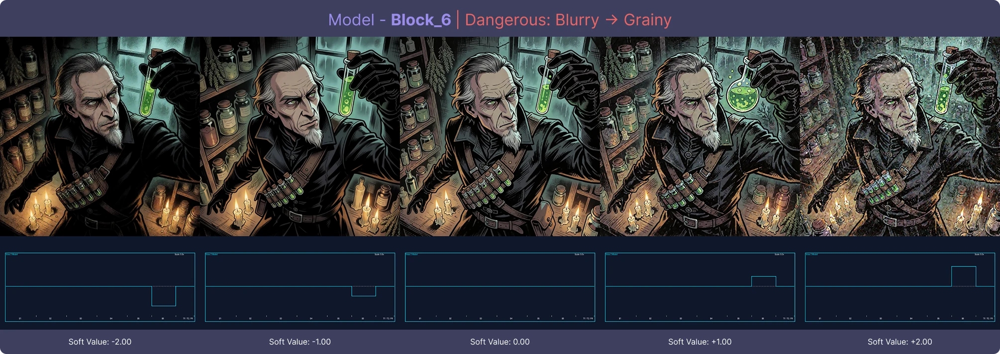</a> |
| **Text Fusion** <br> <a href="assets/examples/TextFusion.webp">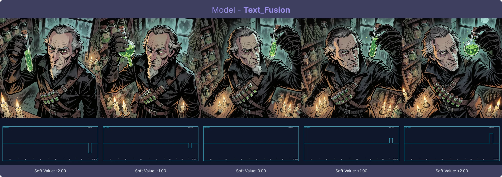</a> | **Time Embed** <br> <a href="assets/examples/Time_Embed.webp">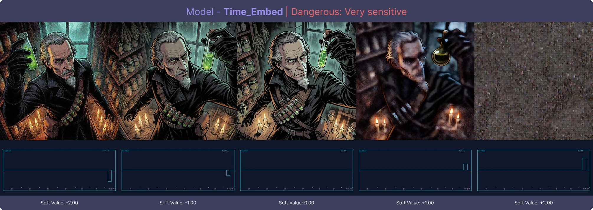</a> |
| **Projection** <br> <a href="assets/examples/Projection.webp">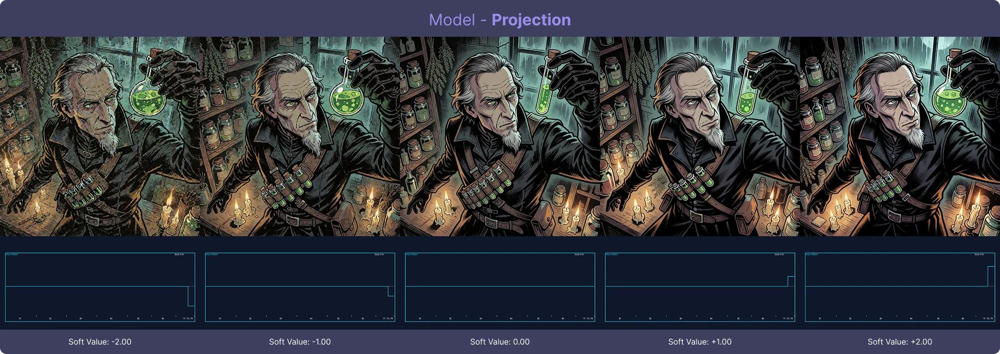</a> | |

---

### 🟨 CLIP Text Encoder Tuning Effects (Layers 1–7, Embedding)

| | |
|---|---|
| **Layer 1** <br> <a href="assets/examples/Layer_1.webp">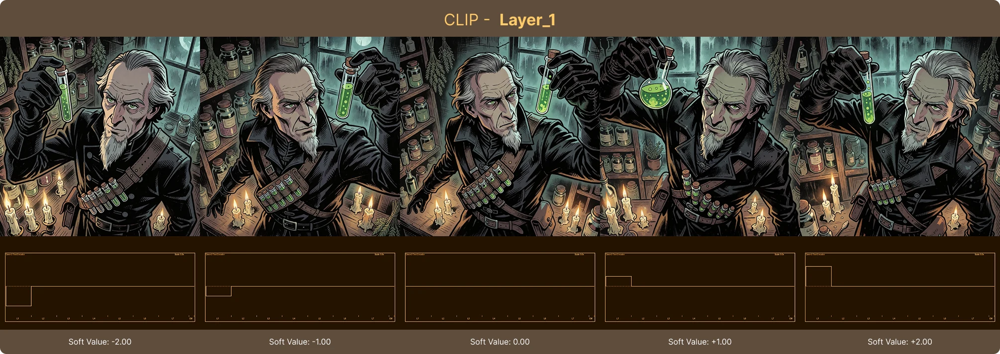</a> | **Layer 2** <br> <a href="assets/examples/Layer_2.webp">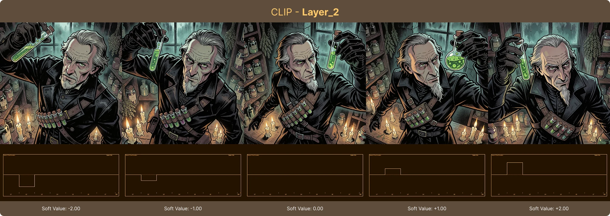</a> |
| **Layer 3** <br> <a href="assets/examples/Layer_3.webp">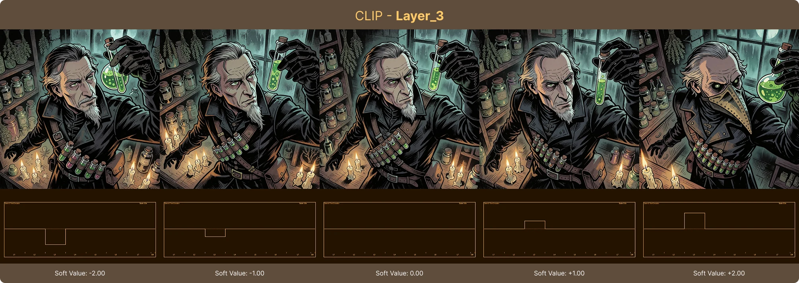</a> | **Layer 4** <br> <a href="assets/examples/Layer_4.webp">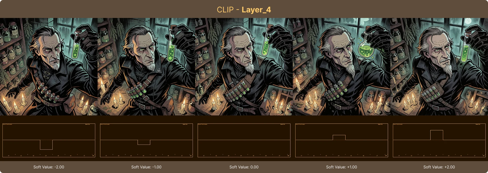</a> |
| **Layer 5** <br> <a href="assets/examples/Layer_5.webp">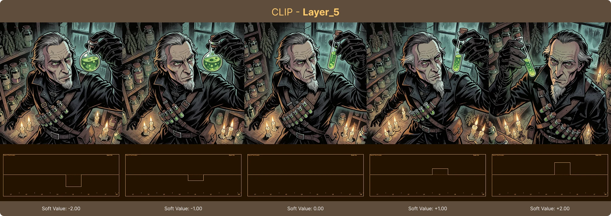</a> | **Layer 6** <br> <a href="assets/examples/Layer_6.webp">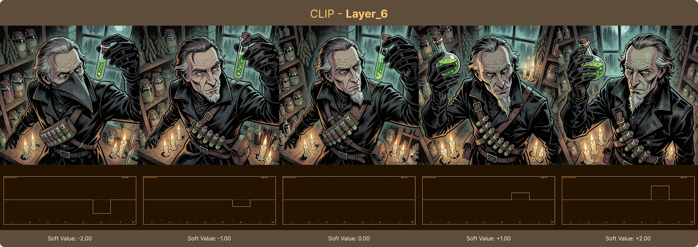</a> |
| **Layer 7** <br> <a href="assets/examples/Layer_7.webp">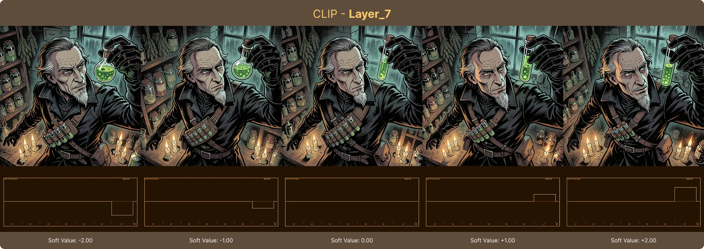</a> | **Embedding** <br> <a href="assets/examples/Embedding.webp">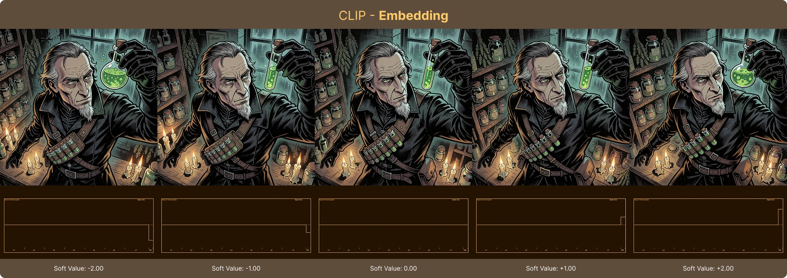</a> |

---

### Deterministic Multi-Seed Persistence

Here you can see how feature isolation works in practice:
By identifying and amplifying only the specific Model blocks and CLIP layers responsible for generating the plague doctor's beak mask, the feature persists robustly and deterministically across completely different generation seeds.

<p align="center">
  <a href="assets/examples/SameTuning-DifferentSeed.webp">
    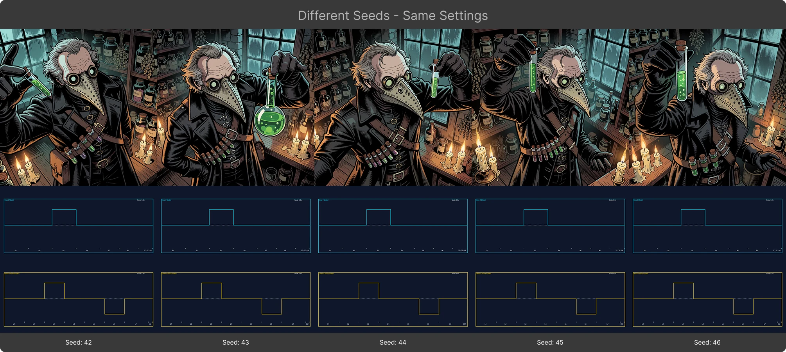
  </a>
</p>

---

## Author

**Arthemy** · [@aledelpho](https://github.com/aledelpho)

---

## License

This project is licensed under the **MIT License** — see the [LICENSE](LICENSE) file for details.
