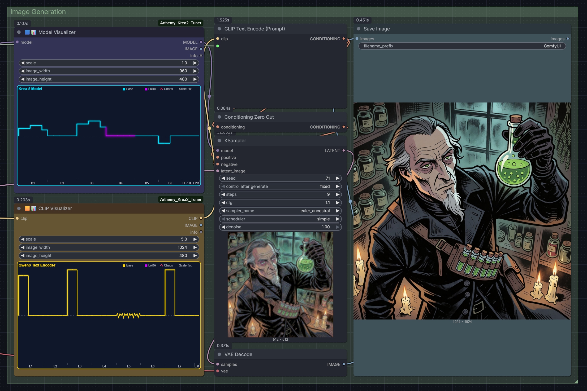
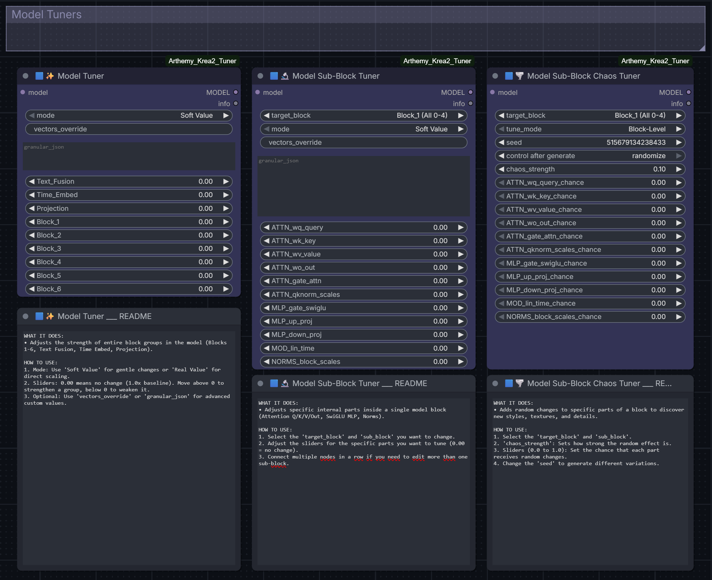
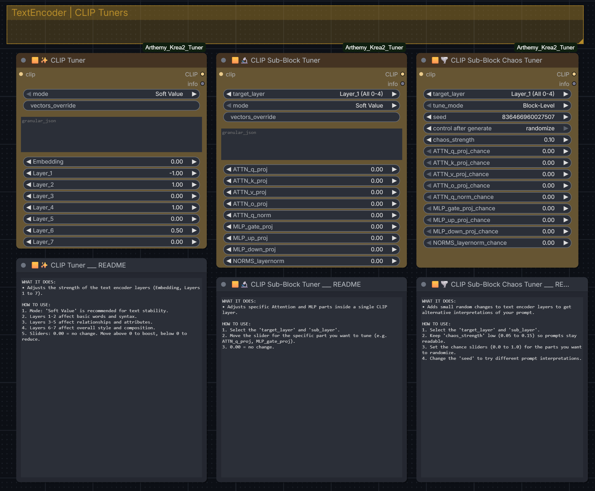
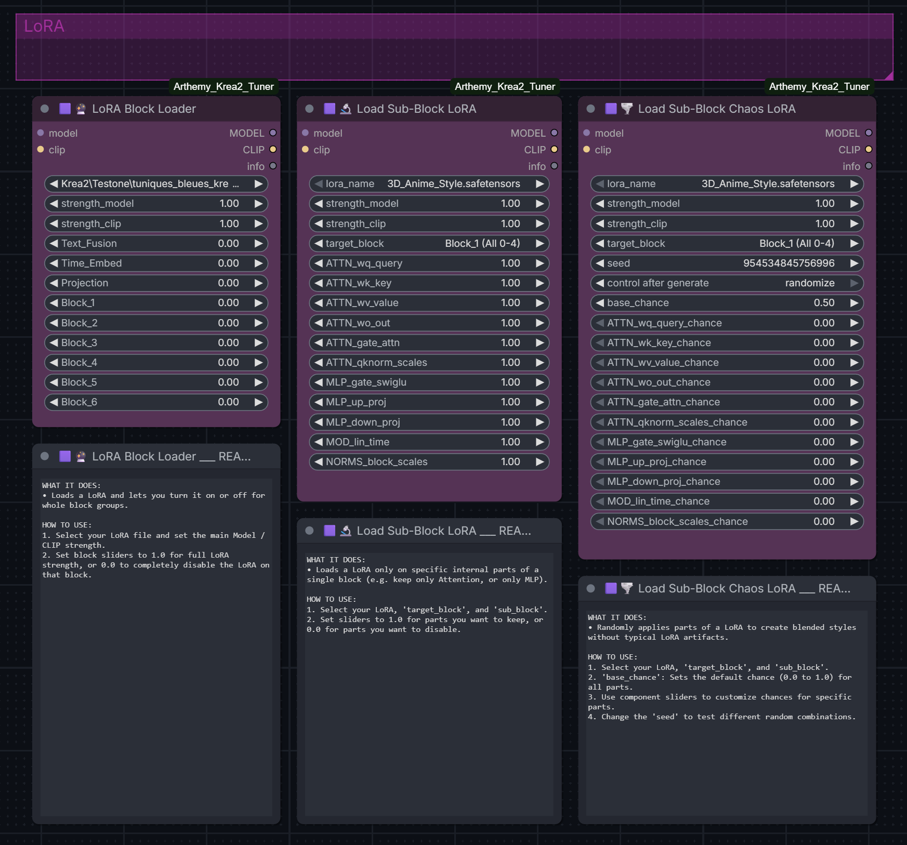
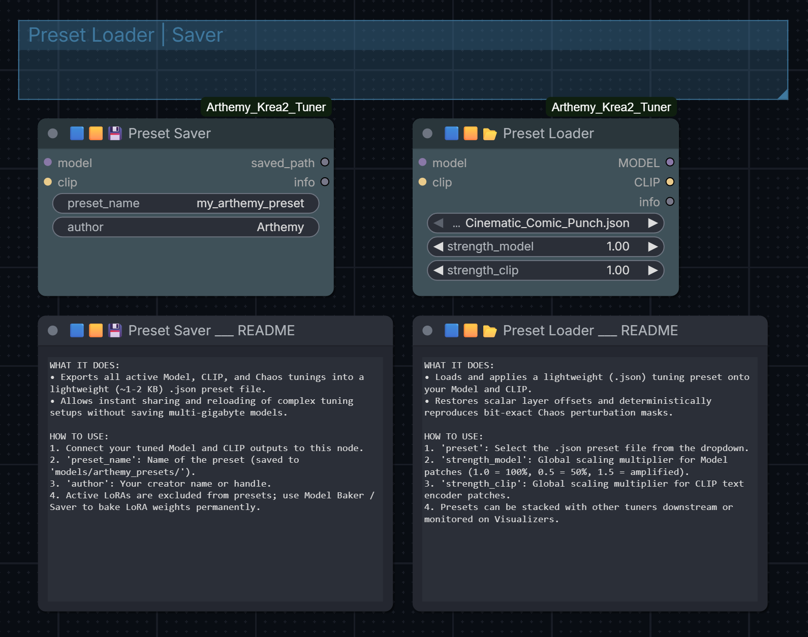
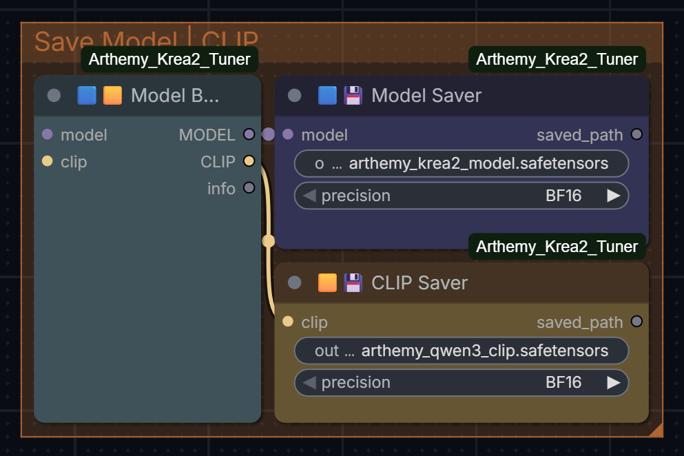

# ✨ Arthemy Krea-2 Tuner

Custom ComfyUI nodes for editing Krea-2 diffusion models and their Qwen3 text encoder directly — no dataset, no retraining. You multiply specific weights up or down, live, and see the result immediately.

If you've ever wanted to customize the shape of a model and its TextEncoder in order for it to represent exactly what you want — whether by tweaking its internal values, boosting only the layers in specific sections, randomly perturbing a LoRA to see what falls out, or saving a calibration you like without exporting a whole new checkpoint — this suite is built for that.



---

## 🚀 Quick start

1. **Load** your `MODEL` and `CLIP`.
2. Add a `🟦✨ Model Tuner` node and connect `MODEL` into it.
3. Move one of the block sliders (`Block_1` … `Block_6`) away from `0.00`. (`0.00` = no change; positive strengthens that group, negative weakens it).
4. Connect the Tuner's `MODEL` output to your sampler and generate. Compare against the untouched model.
5. Chain a `🟨✨ CLIP Tuner` the same way on `CLIP` if you want to adjust the text encoder too.

*Everything else in this doc is for when you want even more control than that.*

---

## 📐 Picking the right node

Three domains (what you're editing) × three precision levels (how targeted you want to be):

| Domain | Tier 1: Group-level | Tier 2: Block + tensor-type | Tier 3: Random / seeded |
|---|---|---|---|
| **🟦 Model** | `🟦✨ Model Tuner` | `🟦🔬 Model Sub-Block Tuner` | `🟦🌪️ Model Sub-Block Chaos Tuner` |
| **🟨 CLIP** | `🟨✨ CLIP Tuner` | `🟨🔬 CLIP Sub-Block Tuner` | `🟨🌪️ CLIP Sub-Block Chaos Tuner` |
| **🟪 LoRA** | `🟪🔮 LoRA Block Loader` | `🟪🔬 Load Sub-Block LoRA` | `🟪🌪️ Load Sub-Block Chaos LoRA` |




### 🟦 Tier 1 — Tuner (whole groups)
One slider per group of blocks:
- **`🟦✨ Model Tuner`**: `Text_Fusion`, `Time_Embed`, `Projection`, `Block_1` to `Block_6`.
- **`🟨✨ CLIP Tuner`**: `Embedding`, `Layer_1` to `Layer_7`.

> *Use this for a general hunch — "Let’s see if this slice will improve or ruin my outputs".*

### 🔬 Tier 2 — Sub-Block Tuner (block + tensor type)
Pick one block (or a full group) from the `target_block` dropdown, then adjust individual sliders for specific tensor types inside it:
- `ATTN_wq_query`, `ATTN_wk_key`, `ATTN_wv_value`, `ATTN_wo_out`, `MLP_gate_swiglu`, `MLP_up_proj`, `MLP_down_proj`, `NORMS_block_scales`, and others (CLIP uses the Qwen3-equivalent names).

> *Use this when you know exactly what you're chasing — "This slice is both improving and ruining my output, let’s see if I can isolate the smaller slice inside it that is improving it".*

### 🌪️ Tier 3 — Chaos Tuner (seeded randomness)
Same targeting as Tier 2, but instead of a fixed multiplier, each matched tensor gets an independent seeded coin-flip: with probability `chance`, it's perturbed by `chaos_strength`; otherwise left untouched. Same seed = same result, every time.
- **Block-Level mode**: perturbs a whole tensor at once.
- **Element-Level (Sub-atomic) mode**: rolls per individual weight, for finer-grained noise.

> *Use when there is no other way — "Let’s see if by changing this sub-slice in a random way I can get exactly what I’m looking for. When I find it, I can fix the seed!"*

---

## 🟪 LoRA loaders — same logic, applied to a LoRA file



- **`🟪🔮 LoRA Block Loader`** — Drop-in replacement for the standard loader, plus per-section strength multipliers (`Text_Fusion`, `Time_Embed`, `Projection`, `Block_1`–`Block_6`).
- **`🟪🔬 Load Sub-Block LoRA`** — Targets one block and one tensor type at a time, so you can keep only, say, the attention layers of a LoRA and drop the rest.
- **`🟪🌪️ Load Sub-Block Chaos LoRA`** — Randomly keeps or drops individual LoRA keys based on per-type chance sliders and a seed.

---

## 🎛️ Reading the sliders

Tier 1 and Tier 2 sliders are offsets from baseline — `0.00` always means "no change." Two modes, set per node:

| Mode | Formula | Use for |
|---|---|---|
| **Soft Value** | `1.0 + (slider × 0.10)` | Gentle nudges — a slider of `1.0` only moves the weight 10%. Good default. |
| **Real Value** | `1.0 + slider` | Direct multiplier — a slider of `1.0` doubles the weight. Bigger, more obvious changes. |

*Chaos sliders work differently:* `chance` (0–1) is the probability a tensor gets touched at all; `chaos_strength` controls how far it moves when it does.

### 📋 Optional overrides for scripting
- **`vectors_override`**: Comma-separated list of raw values that sets every group slider at once — 34 values for Model Tuner, 8 for CLIP Tuner, fixed order. Leave blank to use the sliders instead.
- **`granular_json`**: A JSON object mapping specific tensor-key substrings to their own weight, for precision beyond even the Sub-Block tier. Example: `{"blocks.3.attn.wq": 0.4, "blocks.3.mlp.down": -0.2}`. Leave blank to ignore.

---

## 💾 Saving and loading calibrations

Tuning happens live in memory and doesn't touch your original checkpoint file. Two ways to keep what you've made:

### 📂 Presets (lightweight, sliders only)
- **`🟦🟨💾 Preset Saver`** — Reads whatever is currently patched on your `MODEL`/`CLIP` and writes it to a small JSON file: every Tuner/Sub-Block offset, plus the exact seed + settings for any active Chaos tuning (so Chaos results reproduce exactly, not just approximately).
- **`🟦🟨📂 Preset Loader`** — Pick a saved preset from the dropdown, apply it to a fresh `MODEL`/`CLIP`, with `strength_model` / `strength_clip` dials to scale the whole preset up or down on reload.
- *Note on LoRAs:* Presets only capture Tuner-style and Chaos-style adjustments — not active LoRAs. If a LoRA is loaded on the model when you save a preset, you'll get a warning and it will be excluded; fuse it permanently first (see below) if you want it included.



### 💿 Permanent export (full checkpoint)
- **`🟦🟨 Model Baker`** — Folds all active patches permanently into the weights and clears the patch list in memory. Use this once you're done experimenting, or want to "commit" a result before stacking more changes on top.
- **`🟦💾 Model Saver` / `🟨💾 CLIP Saver`** — Exports to `.safetensors` (BF16 or FP8), streamed to disk to keep memory use down on large checkpoints.
- **`🟦🟨🔄 Reset Patcher`** — Clears all pending patches (including saved Chaos state) without exporting anything, if you want to start over with a clean baseline.



---

## 📊 Seeing what's currently patched

- **`🟦📊 Model Visualizer`** / **`🟨📊 CLIP Visualizer`** — Render a real-time chart showing how much each block is currently patched — a quick sanity check before you spend time rendering.

---

## 🚀 Installation

### Via ComfyUI Manager
Search for **"Arthemy Krea-2 Tuner"** in the ComfyUI Manager and install.

### Manual Installation
```bash
cd ComfyUI/custom_nodes
git clone https://github.com/aledelpho/comfyui-arthemy-krea2-tuner.git
```
Restart ComfyUI afterward.

---

## 🧩 Compatibility

Built for **Krea-2** diffusion checkpoints and their paired **Qwen3** text encoder (including the Qwen3-VL 4B/8B/32B variants). Block/layer counts and tensor-type names are matched to that architecture — these nodes won't do anything meaningful on other model families as-is, though the underlying approach (target by block + tensor type) could be ported to other block-structured architectures.

---

## 👤 Author
**Arthemy** · [@aledelpho](https://github.com/aledelpho)
